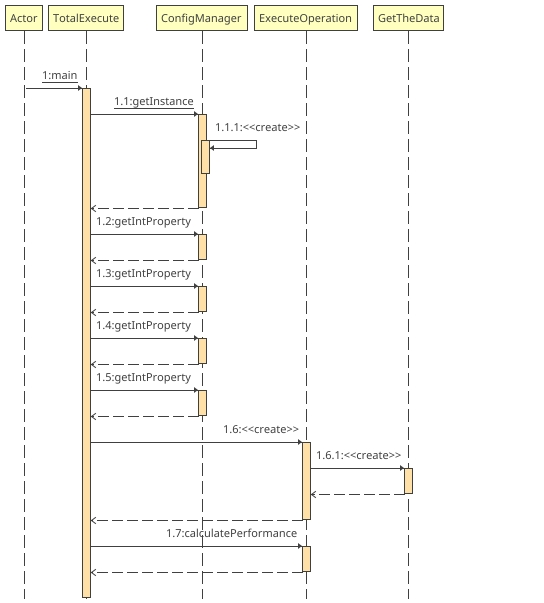
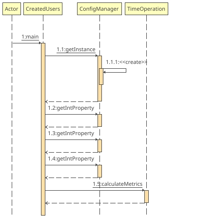

# Performance Testing Project


---

Este proyecto es una aplicación de apoyo para realizar cálculos de volumetría basados en pruebas de rendimiento. Su objetivo es pronosticar la duración de la ejecución en función de varios parámetros, tales como el número de usuarios, el tiempo de ramp-up, los ciclos y la duración de la ejecución por ciclo. Estos parámetros se configuran mediante propiedades que permiten valores de tipo `INT`.
Dentro del proyecto, también encontrarás una herramienta para calcular la creación de usuarios y flujos, basada en configuraciones definidas en un archivo de propiedades.

---
## Indice

1. **Flujo de trabajo**.
2. **Descripción general**.
3. **Requisitos**.
4. **Configuración**.
5. **Estructura del Proyecto**
6. **Compilación y Ejecución**.

---
## Flujo de trabajo de calculadora de volumetría


## Flujo de trabajo de creación de usuarios y flujos
)

---
## Descripción general
### Propiedades de creación de usuarios y flujos

1. **userNumber**:
   - **Descripción**: Este parámetro define el número total de usuarios que se simularán durante la prueba de rendimiento.
   - **Ejemplo**: `userNumber=22000` indica que se simularán 22,000 usuarios.

2. **durationMinutes**:
   - **Descripción**: Este parámetro especifica la duración total de la prueba de rendimiento en minutos.
   - **Ejemplo**: `durationMinutes=60` indica que la prueba de rendimiento durará 60 minutos (1 hora).

3. **flowsPerUser**:
   - **Descripción**: Este parámetro define el número de flujos o transacciones que cada usuario realizará durante la prueba de rendimiento.
   - **Ejemplo**: `flowsPerUser=2` indica que cada usuario realizará 2 flujos o transacciones.

### Ejemplo de Archivo `config-calculate-create-user.properties`

```properties
userNumber=22000
durationMinutes=60
flowsPerUser=2
```

### Descripción Detallada

- **userNumber**:
   - **Propósito**: Determina la carga de usuarios que se simulará en la prueba de rendimiento.
   - **Impacto**: Un mayor número de usuarios puede ayudar a identificar cómo se comporta el sistema bajo una carga pesada y puede revelar problemas de escalabilidad.

- **durationMinutes**:
   - **Propósito**: Establece la duración de la prueba, permitiendo evaluar el rendimiento del sistema durante un período específico.
   - **Impacto**: Una duración más larga puede ayudar a identificar problemas de rendimiento que solo se manifiestan después de un tiempo prolongado de uso.

- **flowsPerUser**:
   - **Propósito**: Define la cantidad de operaciones o transacciones que cada usuario realizará, lo que ayuda a simular un uso más realista del sistema.
   - **Impacto**: Un mayor número de flujos por usuario puede aumentar la carga en el sistema y ayudar a identificar cuellos de botella en el procesamiento de transacciones.

### Propiedades de la Calculadora de Volumetría

1. **numberOfUsers**:
   - **Descripción**: Este parámetro define el número total de usuarios que se simularán durante la prueba de rendimiento.
   - **Ejemplo**: `numberOfUsers=10000` indica que se simularán 10,000 usuarios.

2. **rampUpTime**:
   - **Descripción**: Este parámetro especifica el tiempo de ramp-up en milisegundos, que es el tiempo que se tomará para alcanzar el número total de usuarios simulados.
   - **Ejemplo**: `rampUpTime=60000` indica que se tomará 60,000 milisegundos (60 segundos o 1 minuto) para alcanzar los 10,000 usuarios.

3. **cycles**:
   - **Descripción**: Este parámetro define el número de ciclos que se ejecutarán durante la prueba de rendimiento.
   - **Ejemplo**: `cycles=5` indica que la prueba de rendimiento se ejecutará en 5 ciclos.

4. **executionDuration**:
   - **Descripción**: Este parámetro especifica la duración de la ejecución de cada ciclo en minutos.
   - **Ejemplo**: `executionDuration=30` indica que cada ciclo de la prueba de rendimiento durará 30 minutos.

### Ejemplo de Archivo `config-execution-parameters.properties`

```properties
numberOfUsers=10000
rampUpTime=60000
cycles=5
executionDuration=30
```

### Descripción Detallada

- **numberOfUsers**:
   - **Propósito**: Determina la carga de usuarios que se simulará en la prueba de rendimiento.
   - **Impacto**: Un mayor número de usuarios puede ayudar a identificar cómo se comporta el sistema bajo una carga pesada y puede revelar problemas de escalabilidad.

- **rampUpTime**:
   - **Propósito**: Establece el tiempo necesario para alcanzar el número total de usuarios simulados, permitiendo una introducción gradual de la carga.
   - **Impacto**: Un tiempo de ramp-up adecuado puede ayudar a evitar picos repentinos de carga que podrían distorsionar los resultados de la prueba.

- **cycles**:
   - **Propósito**: Define el número de repeticiones de la prueba de rendimiento, permitiendo evaluar el comportamiento del sistema en múltiples iteraciones.
   - **Impacto**: Ejecutar múltiples ciclos puede ayudar a identificar problemas de rendimiento que solo se manifiestan después de varias iteraciones.

- **executionDuration**:
   - **Propósito**: Establece la duración de cada ciclo de la prueba, permitiendo evaluar el rendimiento del sistema durante períodos específicos.
   - **Impacto**: Una duración adecuada para cada ciclo puede ayudar a identificar problemas de rendimiento que solo se manifiestan después de un tiempo prolongado de uso.

---

## Requisitos Mínimos
Para poder utilizar y ejecutar este proyecto de pruebas de rendimiento en Java, asegúrate de cumplir con los siguientes requisitos mínimos:

### Requisitos de Software

1. **Java Development Kit (JDK) 17 o superior**:
   - **Descripción**: El proyecto está desarrollado utilizando Java 17, por lo que necesitas tener instalado el JDK 17 o una versión superior.
   - **Instalación**:
      - **Windows/Mac/Linux**: Puedes descargar el JDK desde el sitio oficial de Oracle [aquí](https://www.oracle.com/java/technologies/javase-jdk17-downloads.html) o utilizar una distribución alternativa como OpenJDK disponible [aquí](https://openjdk.java.net/install/).

2. **Apache Maven 3.6.3 o superior**:
   - **Descripción**: Maven es una herramienta de gestión y comprensión de proyectos que se utiliza para compilar, empaquetar y gestionar las dependencias del proyecto.
   - **Instalación**:
      - **Windows/Mac/Linux**: Puedes descargar Maven desde el sitio oficial [aquí](https://maven.apache.org/download.cgi) y seguir las instrucciones de instalación [aquí](https://maven.apache.org/install.html).

### Requisitos de Hardware

1. **Memoria RAM**:
   - **Mínimo**: 4 GB
   - **Recomendado**: 8 GB o más
   - **Descripción**: La cantidad de memoria RAM necesaria puede variar dependiendo de la carga de usuarios y la complejidad de las pruebas de rendimiento.

2. **Espacio en Disco**:
   - **Mínimo**: 500 MB de espacio libre
   - **Recomendado**: 1 GB o más
   - **Descripción**: El espacio en disco es necesario para almacenar los archivos del proyecto, dependencias de Maven y archivos temporales generados durante la compilación y ejecución.

3. **Procesador**:
   - **Mínimo**: Procesador de 2 núcleos
   - **Recomendado**: Procesador de 4 núcleos o más
   - **Descripción**: Un procesador más rápido y con más núcleos puede mejorar el rendimiento de la compilación y ejecución de las pruebas.

### Configuración del Entorno

1. **Configurar la variable de entorno JAVA_HOME**:
   - **Descripción**: Asegúrate de que la variable de entorno `JAVA_HOME` esté configurada y apunte al directorio de instalación del JDK.
   - **Windows**:
      - Abre el Panel de Control -> Sistema y Seguridad -> Sistema -> Configuración avanzada del sistema.
      - Haz clic en "Variables de entorno" y luego en "Nueva" para agregar `JAVA_HOME` con el valor del directorio de instalación del JDK.
   - **Mac/Linux**:
      - Abre un terminal y edita el archivo de configuración de tu shell (`.bashrc`, `.zshrc`, etc.) para agregar la siguiente línea:
        ```sh
        export JAVA_HOME=/ruta/al/directorio/de/instalacion/del/jdk
        export PATH=$JAVA_HOME/bin:$PATH
        ```
      - Guarda el archivo y ejecuta `source ~/.bashrc` o `source ~/.zshrc` para aplicar los cambios.

2. **Configurar la variable de entorno MAVEN_HOME**:
   - **Descripción**: Asegúrate de que la variable de entorno `MAVEN_HOME` esté configurada y apunte al directorio de instalación de Maven.
   - **Windows**:
      - Abre el Panel de Control -> Sistema y Seguridad -> Sistema -> Configuración avanzada del sistema.
      - Haz clic en "Variables de entorno" y luego en "Nueva" para agregar `MAVEN_HOME` con el valor del directorio de instalación de Maven.
   - **Mac/Linux**:
      - Abre un terminal y edita el archivo de configuración de tu shell (`.bashrc`, `.zshrc`, etc.) para agregar la siguiente línea:
        ```sh
        export MAVEN_HOME=/ruta/al/directorio/de/instalacion/de/maven
        export PATH=$MAVEN_HOME/bin:$PATH
        ```
      - Guarda el archivo y ejecuta `source ~/.bashrc` o `source ~/.zshrc` para aplicar los cambios.

### Verificación de la Configuración

1. **Verificar la instalación de Java**:
   - Ejecuta el siguiente comando en la terminal para verificar que Java está correctamente instalado y configurado:
     ```sh
     java -version
     ```
   - Deberías ver una salida que muestra la versión de Java instalada.

2. **Verificar la instalación de Maven**:
   - Ejecuta el siguiente comando en la terminal para verificar que Maven está correctamente instalado y configurado:
     ```sh
     mvn -v
     ```
   - Deberías ver una salida que muestra la versión de Maven instalada y la versión de Java que está utilizando.
---

## Configuración

Asegúrate de tener un archivo de propiedades llamado `config.properties` en el classpath del proyecto. Este archivo debe contener las siguientes propiedades:

```properties
performanceTest.numberOfUsers=100
performanceTest.rampUpTime=60000  # en milisegundos
performanceTest.cycles=10
performanceTest.executionDuration=2  # en minutos
performanceTest.flowsPerUser=5
```
---

## Estructura del Proyecto

```
./generated-sources
./generated-sources/annotations
./classes
./classes/com
./classes/com/performance
./classes/com/performance/org
./classes/com/performance/org/data
./classes/com/performance/org/data/ValueProperty.class
./classes/com/performance/org/calculate
./classes/com/performance/org/calculate/ExecuteOperation.class
./classes/com/performance/org/calculate/TimeOperation.class
./classes/com/performance/org/funtion
./classes/com/performance/org/funtion/GetTheData.class
./classes/com/performance/org/CreatedUsers.class
./classes/com/performance/org/message
./classes/com/performance/org/message/MessageLoggerCalculate.class
./classes/com/performance/org/message/MessageLoggerExecute.class
./classes/com/performance/org/conf
./classes/com/performance/org/conf/ConfigManager.class
./classes/com/performance/org/TotalExecute.class
./classes/config-calculate-create-user.properties
./classes/config-execution-parameters.properties

```
### Estructura del Proyecto
```
performance-testing/
├── src/
│   ├── main/
│   │   ├── java/
│   │   │   ├── com.performance.org/
│   │   │   │   ├── calculate/
│   │   │   │   │   ├── ExecuteOperation.java
│   │   │   │   │   ├── TimeOperation.java
│   │   │   │   ├── conf/
│   │   │   │   │   ├── ConfigManager.java
│   │   │   │   ├── data/
│   │   │   │   │   ├── ValueProperty.java
│   │   │   │   ├── funtion/
│   │   │   │   │   ├── GetTheData.java
│   │   │   │   ├── message/
│   │   │   │   │   ├── MessageLoggerCalculate.java
│   │   │   │   │   ├── MessageLoggerExecute.java
│   │   │   │   ├── CreatedUsers.java
│   │   │   │   ├── TotalExecute.java
│   │   ├── resources/
│   │   │   ├── config-calculate-create-user.properties
│   │   │   ├── config-execution-parameters.properties
├── pom.xml
└── README.md
```
---

## Compilación y Ejecución
Para compilar y empaquetar el proyecto, sigue estos pasos:

1. **Navega al directorio raíz del proyecto**: Abre una terminal y navega al directorio donde se encuentra el archivo `pom.xml`.

    ```sh
    cd performance-testing
    ```

2. **Ejecuta el comando de Maven**: Utiliza el siguiente comando para limpiar, compilar y empaquetar el proyecto.

    ```sh
    mvn clean package
    ```

   Este comando realizará las siguientes acciones:
    - Limpiará el directorio `target` de cualquier compilación anterior.
    - Compilará el código fuente del proyecto.
    - Ejecutará las pruebas (si las hay).
    - Empaquetará el proyecto en un archivo JAR dentro del directorio `target`.

### Ejecución del Proyecto

Después de compilar el proyecto, sigue estos pasos para ejecutarlo:

1. **Ejecuta el archivo JAR generado**: Utiliza el siguiente comando para ejecutar el archivo JAR que se encuentra en el directorio `target`.

    ```sh
    java -jar target/performance-testing-1.0-SNAPSHOT.jar
    ```

   Asegúrate de reemplazar `performance-testing-1.0-SNAPSHOT.jar` con el nombre real del archivo JAR generado si es diferente.

---
Este `README.md` proporciona una guía completa para cualquier desarrollador que quiera entender, configurar, compilar y ejecutar el proyecto.